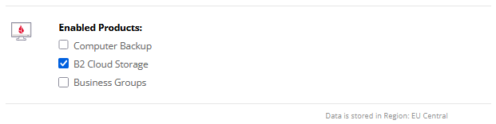

## Upload backup file to Backblaze B2

### Initial requirements

1) Register a Backblaze account and login https://www.backblaze.com/ <br />
Please ensure "`B2 Cloud Storage`" product is enabled for your account - *Settings* > *Enabled Products*.


2) Create Backblaze bucket

3) Create an Application key

4) Add dedicated KeePass trigger for upload database file to Backblaze bucket

### File upload via HTTP request

https://www.backblaze.com/apidocs/s3-put-object

Upload file:

```sh
curl -X PUT \
  --user "YOUR_KEY_ID:YOUR_APPLICATION_KEY" \
  --aws-sigv4 "aws:amz:YOUR_REGION:s3" \
  -T "/path/to/local/file.ext" \
  https://s3.YOUR_REGION.backblazeb2.com/YOUR_BUCKET_NAME/file.ext

```

Download file:

```sh
curl --user "$KEY_ID:$APPLICATION_KEY" \
  --aws-sigv4 "aws:amz:$REGION:s3" \
  https://s3.$REGION.backblazeb2.com/$BUCKET_NAME/file.ext \
  -o "/path/to/local/file.ext"
```

You can get `YOUR_REGION` from bucket endpoint e.g.
`Bucket Endpoint = s3.eu-central-003.backblazeb2.com`  => `YOUR_REGION = eu-central-003`

Whether the uploaded file is private or publicly accessible depends entirely on your bucket's privacy settings.
Backblaze B2 sets privacy at the bucket level. All files uploaded to a bucket automatically inherit that bucket's access rules.

According to Backblaze's documentation, files encrypted with server-side encryption are not available for direct download via the standard Backblaze B2 Web UI Browse Files page to protect confidentiality. Instead, you must access and download them using the API.

### Resources

- https://www.backblaze.com/docs
- [Introduction to the S3-Compatible API](https://www.backblaze.com/apidocs/introduction-to-the-s3-compatible-api)
- [How to Enable Backblaze B2 Cloud Storage on Your Account](https://www.backblaze.com/docs/cloud-storage-enable-backblaze-b2)
- [Backblaze Buckets](https://www.backblaze.com/docs/cloud-storage-buckets)
- [Application Keys](https://www.backblaze.com/docs/cloud-storage-application-keys)
- [Server-Side Encryption](https://www.backblaze.com/docs/cloud-storage-server-side-encryption)
- [Backblaze B2 pricing](https://www.backblaze.com/cloud-storage/pricing)
- [StackOverflow Backblaze questions](https://stackoverflow.com/questions/tagged/Backblaze)
