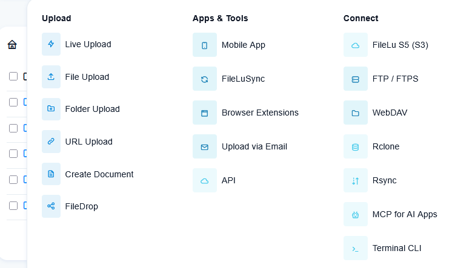

## Upload backup file to FileLu

FileLu is secure, encrypted cloud storage with S3, WebDAV, Rclone, Rsync, and AI app connectivity through MCP.


### Initial requirements

- An active FileLu account. [Sign up here](https://filelu.com/register/) if you do not have one.
- Valid Access Key ID and Secret Access Key.

### File upload via S3-Compatible API

Because FileLu S5 fully supports AWS Signature Version 4, you can use curl's native --aws-sigv4 parameter in the exact same fashion as Cloudflare R2 or AWS S3.

```sh
curl "https://ENDPOINT/BUCKET_NAME/my_file.ext" \
  --aws-sigv4 "aws:amz:auto:s3" \
  --user "ACCESS_KEY_ID:SECRET_ACCESS_KEY" \
  --upload-file "/path/to/local/my_file.ext"
```
Where `ENDPOINT` is the endpoint for your selected region e.g. `https://eu.s5lu.com`, `BUCKET_NAME` is the name of the bucket you can find in _Account Dashboard_ > _My Files_. Please note, free users can only create 1 bucket.

### File upload via FileLu API

Step 1: Get server upload URL

```sh
curl https://filelu.com/api/upload/server?key=YOUR_API_KEY
```

example response:

```json
{
    "status": 200,
    "msg": "OK",
    "sess_id": "34541df1fd1b499fabc",
    "result": "https://123.cdnguest.space/cgi-bin/upload.cgi?upload_type=API&",
    "server_time": "2026-08-29 09:25:45"
}
```

Step 2: Upload file to Upload URL

```sh
curl -F "sess_id=SESS_ID" -F "utype=prem" -F "file_0=@/path/to/local/my_file.ext" UPLOAD_URL
```

Where `SESS_ID` and `UPLOAD_URL` are taken from Step 1 response;

### Resources

- https://filelu.com/
- [FileLu S5 Object Storage](https://filelu.com/pages/s5-object-storage/)
- [FileLu API](https://filelu.com/pages/api/)
- [FileLu WebDAV](https://filelu.com/pages/cloud-drive-webdav/)
