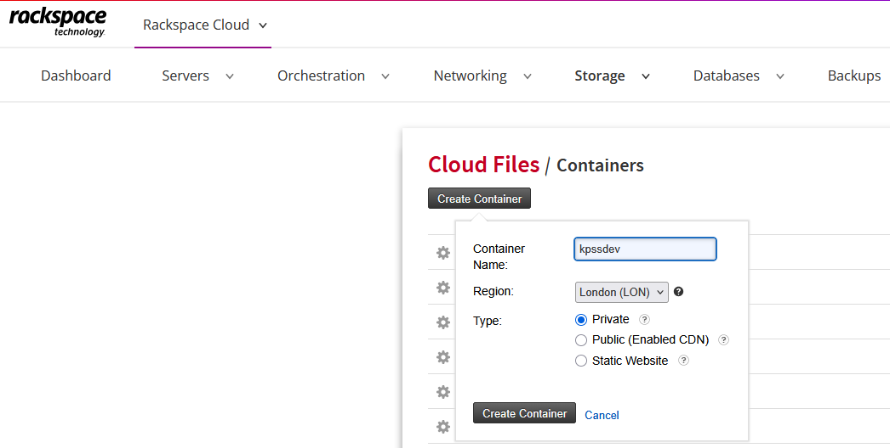
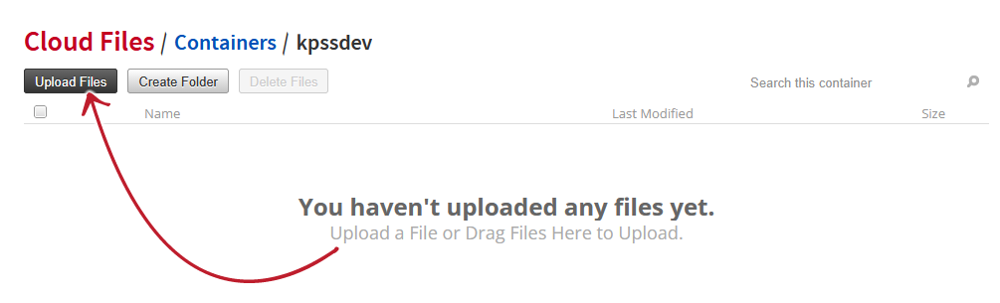

## Upload backup file to Rackspace Cloud Files

### Initial requirements

1) Log in to your Rackspace account then navigate to<br /> _Rackspace Cloud_ > _Storage_ > _Files_ > and create a _Private_ containder:


_Note_: Private Containers allow you to securely store data on the cloud and access it via the Control Panel or API. Files inside such container are not accessible via public CDN.


Get your API Key by visiting your account > _My Profile & Settings_ > _Security Settings_ > _Rackspace API Key_.

2) Create KeePass Trigger to upload *.kdbx file to Rackspace Cloud Files via API

### File upload via HTTP request

```sh
#!/bin/bash

USERNAME=$1
API_KEY=$2
REGION=$3
CONTAINER=$4
FILE_PATH=$5

CONTENT_TYPE=$(file -b --mime-type "$FILE_PATH")
FILENAME="${FILE_PATH##*/}"

RESPONSE=$(curl -s -X POST https://identity.api.rackspacecloud.com/v2.0/tokens \
  -H "Content-Type: application/json" \
  -d "{
    \"auth\": {
      \"RAX-KSKEY:apiKeyCredentials\": {
        \"username\": \"$USERNAME\",
        \"apiKey\": \"$API_KEY\"
      }
    }
  }")

AUTH_TOKEN=$(echo "$RESPONSE" | jq -r '.access.token.id')

STORAGE_ENDPOINT=$(echo "$RESPONSE" | jq --arg reg "$REGION" -r '
  .access.serviceCatalog[]
  | select(.type == "object-store")
  | .endpoints[]
  | select(.region == $reg)
  | .publicURL
')

# 4. Upload file to selected container
curl -i -X PUT $STORAGE_ENDPOINT/$CONTAINER/$FILENAME \
  -H "X-Auth-Token: $AUTH_TOKEN" \
  -H "Content-Type: $CONTENT_TYPE" \
  -T $FILE_PATH
```

Execute the file:

```sh
./rackspace.bash UserName ApiKey Region Container FullPathToLocalFile
```

Example response:

```sh
HTTP/1.1 201 Created
Last-Modified: Tue, 18 Aug 2026 13:39:32 GMT
Content-Length: 0
Etag: 9aa433d1b2e2a4b2ef99b1b34cd9d662
Content-Type: text/html; charset=UTF-8
X-Trans-Id: txd9abce7d03454cf0bb4bf-334a846093lon3
Date: Tue, 18 Aug 2026 13:39:31 GMT
```

### Resources

- [Rackspace - Cloud Files](https://docs.rackspace.com/docs/cloud-files)
- [Cloud Files Key Concepts](https://docs.rackspace.com/docs/cloud-files-key-concepts)
- [Cloud Files FAQ](https://docs.rackspace.com/docs/cloud-files-faq)